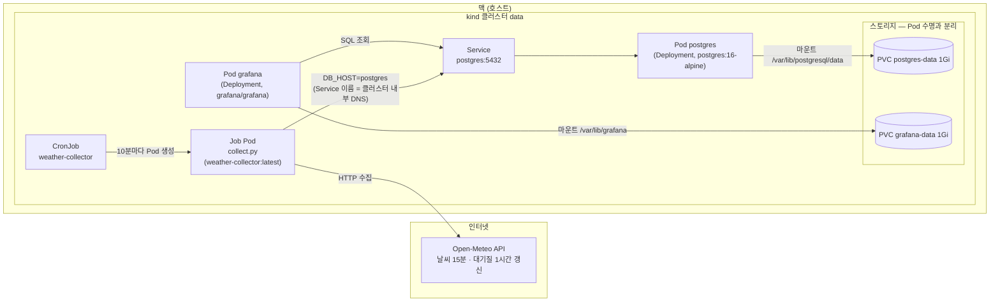

# weather-pipeline

Open-Meteo API에서 서울의 현재 날씨와 대기질을 10분마다 수집해 Postgres에 적재하는 로컬 k8s 데이터 파이프라인.

## 아키텍처



- 테이블 2개(`weather`, `air_quality`)로 분리: 두 API의 갱신 주기가 달라(900초 / 3600초) 수집 시각(`collected_ts`)이 서로 다르기 때문.
- 중복 방지: `PRIMARY KEY (collected_ts)` + `ON CONFLICT (collected_ts) DO NOTHING`. 10분마다 수집해도 API 값이 안 바뀌었으면 행이 늘지 않는다.

## 처음부터 실행하기

```bash
# 1. 클러스터 생성
kind create cluster --name data

# 2. 수집기 이미지 빌드 + kind에 로드 (kind는 로컬 docker 이미지를 못 봄)
docker build -t weather-collector .
kind load docker-image weather-collector:latest --name data

# 3. DB 비밀번호 Secret 생성 (배포 전에 필수 — 없으면 Pod가 CreateContainerConfigError)
kubectl create secret generic postgres-credentials --from-literal=POSTGRES_PASSWORD=devpw

# 4. 배포
kubectl apply -f k8s/

# 5. 확인
kubectl get pods                # postgres Running, 10분마다 weather-collector-* Completed
kubectl get pvc                 # postgres-data Bound

# 6. 크론 안 기다리고 즉시 1회 실행
kubectl create job --from=cronjob/weather-collector test-run

# 7. 데이터 확인
kubectl exec deploy/postgres -- psql -U postgres -d weather -c 'SELECT * FROM weather;'
kubectl exec deploy/postgres -- psql -U postgres -d weather -c 'SELECT * FROM air_quality;'

# 8. Grafana 대시보드 (admin/admin, 데이터소스 Host는 postgres:5432)
kubectl port-forward svc/grafana 3000:3000   # 켜둔 채로 http://localhost:3000
```

## 로컬 개발 (k8s 없이)

```bash
docker run -d --name pg -e POSTGRES_PASSWORD=devpw -e POSTGRES_DB=weather -p 5432:5432 postgres:16-alpine
python3 -m venv .venv && source .venv/bin/activate
pip install "psycopg[binary]"
DB_PASSWORD=devpw python3 collect.py      # DB_HOST 미지정 시 localhost

# 컨테이너로 실행할 땐 localhost가 안 통하므로:
docker run --rm -e DB_HOST=host.docker.internal -e DB_PASSWORD=devpw weather-collector
```

## 밟은 지뢰들

- **코드 고쳤는데 그대로다** → 이미지는 `docker build` 시점의 파일 복사본. 수정하면 리빌드 필수. 트레이스백에 찍힌 코드가 진짜 실행된 코드다.
- **컨테이너 안 localhost는 자기 자신** → Postgres는 밖에 있으므로 connection refused. 접속 주소는 환경변수(`DB_HOST`)로 주입: 로컬 docker는 `host.docker.internal`, k8s는 Service 이름.
- **ON CONFLICT는 unique 제약이 있는 컬럼만** → 대상 컬럼 조합에 정확히 일치하는 unique/PK 제약이 없으면 INSERT 자체가 에러.
- **`:latest` 태그는 imagePullPolicy 기본값이 Always** → 손으로 로드한 로컬 이미지를 무시하고 레지스트리에서 pull 시도하다 실패. `imagePullPolicy: Never`로 차단.
- **`kubectl expose`는 클러스터의 실제 리소스를 참조** → `create --dry-run`과 달리 deployment를 먼저 apply해야 동작.
- **DB Deployment는 `strategy: Recreate`** → 기본 RollingUpdate는 새/옛 Pod가 잠깐 같은 PVC를 동시에 잡아 Postgres 잠금 충돌로 배포가 멈춘다.
- **Pod의 파일시스템은 Pod와 함께 사라진다** → DB 데이터는 PVC에. 볼륨 없이 띄운 데이터는 Pod 교체 시 증발.
- **`NUMERIC(3,1)` 최대값은 99.9** → 미세먼지 심한 날 / 태풍 풍속에 overflow. 컬럼 폭은 극단값 기준으로.
- **secretKeyRef의 세 필드는 역할이 다르다** → env의 `name`은 컨테이너가 받는 환경변수 이름(코드가 읽는 것), `secretKeyRef.name`은 Secret 리소스 이름, `secretKeyRef.key`는 Secret 안의 key. 셋을 헷갈리면 인증 실패 또는 `CreateContainerConfigError`.

## Grafana provisioning

대시보드와 데이터소스 정의는 `grafana/` 아래 파일이 원본이고, `k8s/grafana-config.yaml`(ConfigMap)로 Grafana에 주입된다. 대시보드를 수정하려면 UI가 아니라 `grafana/dashboards/seoul-weather.json`을 고치고 ConfigMap을 재생성해 apply:

```bash
kubectl create configmap grafana-dashboards --from-file=grafana/dashboards/ --dry-run=client -o yaml > /tmp/cm.yaml && kubectl apply -f /tmp/cm.yaml
kubectl rollout restart deploy/grafana
```

DB 비밀번호는 provisioning 파일에 `$DB_PASSWORD` 자리표시자로만 존재하고, 실제 값은 Secret → 환경변수로 주입된다.

## 다음 후보

- 백필(backfill) — 수집이 멈췄던 구간을 Open-Meteo 과거 데이터 API로 메꾸는 스크립트. ON CONFLICT 덕분에 겹쳐 넣어도 안전하다.
