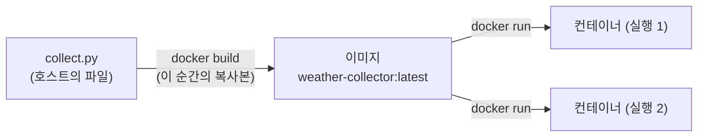

# Docker / 컨테이너

## 이미지 vs 컨테이너

- 이미지: 실행 환경의 스냅샷. `docker build` **시점의** 파일 복사본
- 컨테이너: 이미지를 실제로 실행한 것. 일회용
- 코드 수정 후 반영 안 되면 → 리빌드 안 한 것. 트레이스백에 찍힌 코드가 진짜 실행된 코드



## 컨테이너 네트워크

- 컨테이너는 격리된 네트워크 공간 → 컨테이너 안 `localhost` = 컨테이너 자신
- 호스트의 서비스 접근 (mac): `host.docker.internal` — Docker Desktop 전용 특수 DNS
- `-p 5432:5432`: 컨테이너 포트를 호스트 포트에 연결 (포트 공개)

## 설정 주입

- 원칙: **코드/이미지는 하나, 환경마다 다른 값은 환경변수로 주입**
- 코드: `os.environ.get('DB_HOST', 'localhost')` — 기본값은 로컬 개발용
- 실행: `docker run -e DB_HOST=host.docker.internal ...`
- 같은 이미지가 로컬 docker에서도 k8s에서도 동작하는 이유

## Dockerfile 최소 구성

```dockerfile
FROM python:3.12-slim                          # 베이스 이미지
RUN pip install --no-cache-dir "psycopg[binary]"  # 빌드 시 실행 (의존성 설치)
COPY collect.py /app/collect.py                # 파일을 이미지 안으로
CMD ["python", "/app/collect.py"]              # 컨테이너 시작 시 실행할 명령
```

- venv 불필요 — 컨테이너 자체가 격리
- `--no-cache-dir`: pip 캐시를 이미지에 안 남김 (크기 절약)
