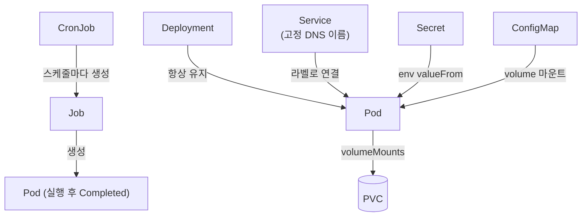

# Kubernetes

## 핵심 리소스

- **Pod**: 컨테이너 실행 단위. 일회용 — 죽으면 끝, IP도 파일도 같이 사라짐
- **Deployment**: "이 Pod N개 항상 유지" 선언 → k8s가 죽은 Pod 자동 교체
- **Service**: Pod는 IP가 바뀌니까 붙이는 고정 이름표. **이름이 곧 클러스터 내부 DNS 주소** (`DB_HOST=postgres`)
- **Job**: 한 번 실행하고 끝나는 Pod (수집기처럼 "실행 → 종료" 작업)
- **CronJob**: Job을 cron 스케줄로 주기 생성
- **PVC**: Pod 밖에 사는 디스크. Pod가 죽어도 데이터 유지
- **Secret**: 민감값 key-value 저장소. base64 인코딩이지 암호화 아님 — 가치는 git에서 분리 + 접근 제어
- **ConfigMap**: Secret의 평문 쌍둥이. 비밀 아닌 설정 파일용



## 볼륨 두 짝

- `volumes` (Pod 레벨): 이 Pod가 쓸 디스크/설정 **목록** — 출처 선언 (PVC, configMap 등)
- `volumeMounts` (컨테이너 레벨): 컨테이너 안 **어디에** 꽂을지
- `name`이 두 목록을 잇는 연결고리

## Secret/ConfigMap 주입 — 세 필드 구분

```yaml
- name: DB_PASSWORD              # ① 컨테이너 안 환경변수 이름 = 코드가 읽는 이름
  valueFrom:
    secretKeyRef:
      name: postgres-credentials # ② 어느 Secret 리소스에서
      key: POSTGRES_PASSWORD     # ③ 그 안의 어느 key를
```

- ①과 ③은 달라도 됨 — 헷갈리면 인증 실패 또는 `CreateContainerConfigError`

## 배포 전략

- 기본 RollingUpdate: 새 Pod 먼저 띄우고 → 준비되면 옛 Pod 제거 (무중단)
- DB처럼 PVC 하나를 쓰는 앱은 **Recreate**: 옛것 먼저 죽이고 새것 — 두 Pod가 같은 디스크 동시에 잡으면 잠금 충돌로 배포가 멈춤

## kind 로컬 클러스터

- kind = docker 컨테이너 안에서 도는 k8s. 자기만의 이미지 창고 보유
- 로컬 이미지는 손으로 넣어야 함: `kind load docker-image <이미지> --name <클러스터>`
- `:latest` 태그의 imagePullPolicy 기본값은 Always → 로컬 이미지 무시하고 pull 시도 → `imagePullPolicy: Never`로 차단

## 접근/디버깅

- `kubectl port-forward svc/grafana 3000:3000`: 클러스터 내부 Service를 호스트로 터널링. 명령이 살아있는 동안만 유지, 대상 Pod 죽으면 끊김
- `kubectl logs`, `kubectl describe pod <이름>`: 안 뜨는 Pod의 이유는 describe가 말해줌
- `kubectl create <리소스> --dry-run=client -o yaml`: yaml 뼈대 생성기 — 백지에서 쓰는 사람 없음
- `kubectl expose`는 클러스터의 **실존 리소스**를 참조 → 먼저 apply 필요
