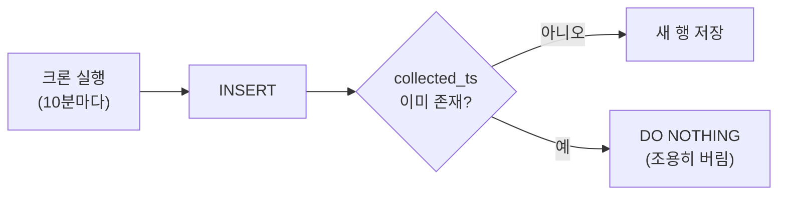

# Postgres / 데이터 모델링

## 테이블 분리 기준

- 두 API의 갱신 주기가 다름 (날씨 15분, 대기질 1시간) → 수집 시각이 서로 다름
- 시각이 다른 데이터를 한 행에 합치면 거짓말 → 테이블 2개 (`weather`, `air_quality`)

## 중복 방지 (dedup)

- 자연 키: `collected_ts` (API가 준 관측 시각) — 같은 시각 = 같은 측정값
- `PRIMARY KEY (collected_ts)` + `ON CONFLICT (collected_ts) DO NOTHING`
- **ON CONFLICT는 unique 제약이 있는 컬럼 조합만 가능** — 없으면 INSERT 자체가 에러
- 중복 판별은 파이썬이 아니라 DB 기능으로 (여러 프로세스가 동시에 넣어도 안전)
- content hash 컬럼은 불필요했음 — hash 입력에 시각이 포함되면 판별력이 collected_ts와 동일 (YAGNI)

## 수집 주기 vs 데이터 갱신 주기

- 크론 10분 격자 vs API 갱신 15분 격자 → 실행 6번 중 2번은 헛걸음, 행은 15분 간격으로 남음
- 갱신 주기에 크론을 딱 맞추면(`*/15`) API 갱신이 살짝 늦을 때 포인트 통째로 유실
- **갱신보다 촘촘히 돌고 중복은 DB가 버리는 구조가 더 견고**
- :15/:45 값은 :20/:50 실행이 가져옴 — 최대 10분 지연은 구조상 자연스러움

## 타입 선택

- `TIMESTAMPTZ`: 문자열이 아니라 **절대 시점** 저장. psql이 UTC로 보여주는 건 세션 타임존 표시일 뿐
- 원칙: **저장은 UTC(절대 시점), 표시는 보는 사람의 로컬** — Grafana가 KST로 보여주는 건 표시층 변환
- `NUMERIC(3,1)` 최대값은 99.9 — 미세먼지 심한 날/태풍 풍속에 overflow. 컬럼 폭은 극단값 기준
- `inserted_ts DEFAULT now()`: 관측 시각과 적재 시각을 분리 기록 — 지연 분석 가능

## 데이터 생존 계층

- 컨테이너/Pod 파일시스템: Pod와 함께 소멸
- PVC: Pod 교체에도 생존, 클러스터 삭제엔 소멸
- 완전 복구 불가 구간: 백필(과거 데이터 API)로 메꿈 — ON CONFLICT 덕에 겹쳐 넣어도 안전
