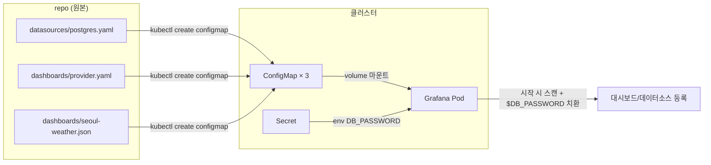

# Grafana

## 쿼리 규칙

- 시계열 패널: `time` 컬럼(별칭) + 숫자 컬럼들 → 숫자 컬럼 개수만큼 시리즈
- `WHERE $__timeFilter(collected_ts)`: 상단 시간 선택기를 WHERE 조건으로 치환 — 없으면 매번 전체 스캔
- `pm10 AS "PM10"`: SQL 별칭이 곧 범례 이름

## 시각화 선택 기준

- **선**: 연속 측정값의 흐름 (온도, 습도, 농도) — 이 프로젝트 전부 해당
- **바**: 구간별로 닫힌 값 (일별 강수량, 시간당 건수) — 집계 패널에서 등장
- **area**: 0이 진짜 바닥인 값만. 온도처럼 0이 의미 없는 값엔 부적합. 시리즈 겹치면 fill 10~20%만
- **Stack 금지 사례**: PM2.5 ⊂ PM10 — 부분집합을 쌓으면 합계가 거짓말
- 패널 제목엔 단위: "기온 (°C)" — 22가 °C인지 %인지 축만으론 헷갈림
- 원칙: 예쁜가보다 **숫자를 안 속이나**

## Provisioning — 대시보드도 코드

- 마우스로 만든 대시보드의 실체는 원래 JSON — UI는 편집기일 뿐
- 문제: Grafana 내부(PVC)에만 존재 → 클러스터 삭제 시 소실, 변경 이력 없음, 재현 불가
- 해법: JSON을 repo에 두고 Grafana가 시작할 때 `/etc/grafana/provisioning/`을 스캔해 자동 등록

- 비번은 provisioning 파일에 `$DB_PASSWORD` 자리표시자만 — 실제 값은 Secret → 환경변수 → Grafana가 시작 시 치환
- 데이터소스에 고정 `uid` 부여 (`weather-postgres`) — 마우스로 만든 데이터소스의 랜덤 uid를 JSON에서 교체해야 패널이 연결됨
- provisioned 대시보드는 UI 수정 불가 — "원본은 git"이라는 뜻. 수정 = JSON 고치고 ConfigMap 재생성
- export 포맷 주의: UI export는 신형(`apiVersion/kind/spec` 봉투), 파일 provisioning은 클래식(`title/panels` 맨 바깥)만 읽음 → API(`/api/dashboards/uid/...`)에서 클래식으로 추출
