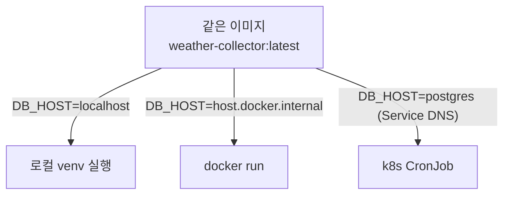

# 설계 원칙

## 하나의 원칙, 세 번의 적용

- **"움직이는 것과 남는 것을 분리하고, 남는 것의 원본을 git에 둔다"**

| 적용 | 움직이는 것 (일회용) | 남는 것 (원본) |
|---|---|---|
| 인프라도 코드 | Pod, 컨테이너 | `k8s/*.yaml` |
| 설정 주입 | 실행 환경 | 환경변수 ← Secret/ConfigMap |
| 대시보드도 코드 | Grafana 내부 상태 | `grafana/*.json`, `*.yaml` |

- 결과: `kind delete cluster` 해도 repo만 있으면 전체 복원 (데이터 제외 — 그건 백필의 몫)

## 코드 하나, 설정 주입

- 주소/비번을 코드에 박으면: 환경 바뀔 때마다 코드 수정 + 리빌드
- 환경변수로 빼면: 이미지 하나가 모든 환경에서 동작

## 작게 관통, 그다음 살 붙이기

- 큰 앱을 먼저 만들지 않고, 최소 파이프라인을 처음부터 끝까지 관통시킨 뒤 한 조각씩 추가
- 매 단계 "돌아가는 상태"로 끝냄 → 막히는 지점이 항상 방금 바꾼 곳
- 실제 순서: 스크립트 → DB → Docker → k8s → CronJob → Secret → Grafana → provisioning

## 기타 배운 원칙

- YAGNI: 필요 증명 전엔 안 만든다 (hash 컬럼, id UUID 삭제 사례)
- 실패는 시끄럽게: 비번 기본값을 devpw가 아닌 `''`로 — 조용히 되는 것보다 크게 실패가 낫다
- 검증은 파괴로: Pod 죽여서 데이터 생존 확인 — "될 것이다"가 아니라 "봤다"
- 문서는 코드 옆에: README/docs가 repo에 살아야 코드와 같이 늙는다
- 지뢰 기록이 자산: 남의 블로그에 없는, 직접 밟아서 아는 것들
